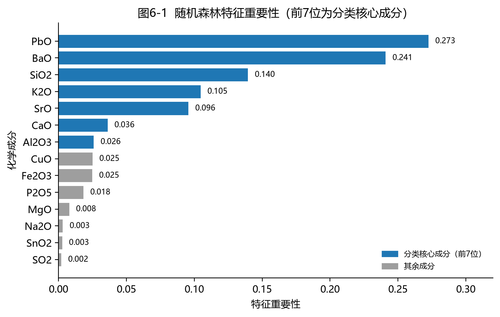
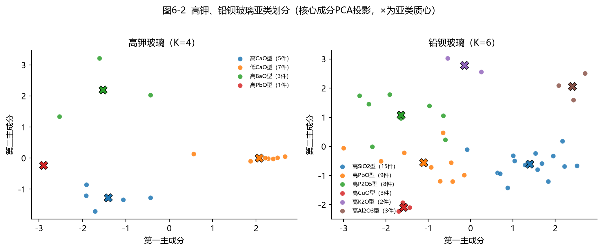
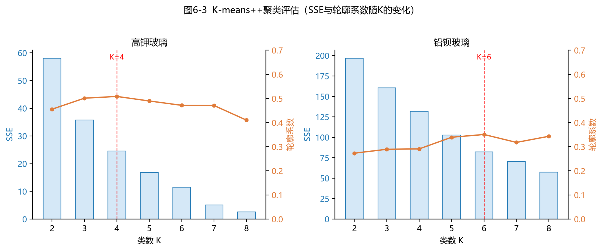
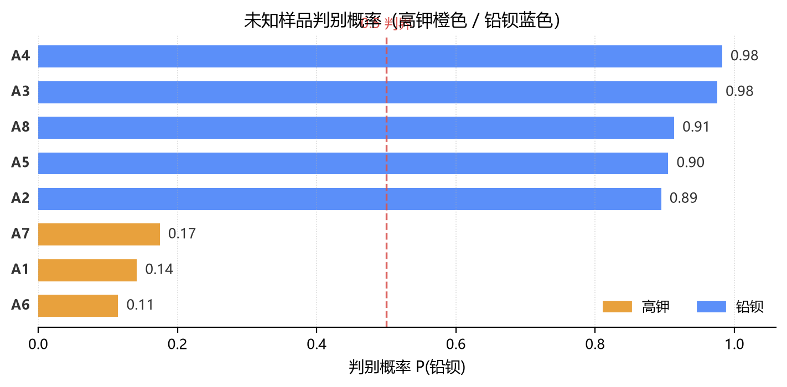

# 标题

## 摘要

## 关键词

## 问题重述

古玻璃是丝绸之路中西贸易与文化交流的重要物证。我国本土古玻璃借鉴域外技术，外观与外来玻璃相近，但化学成分存在明显区别。玻璃基体成分为二氧化硅，炼制时添加不同助熔剂形成两大类别：草木灰作为助熔剂得到高钾玻璃，氧化钾含量突出；铅钡矿石作为助熔剂得到铅钡玻璃，氧化铅、氧化钡含量较高。文物埋藏过程中易发生风化，元素交换会改变成分占比，干扰类型识别。

题目提供三套数据集：文物基础信息、已知类别玻璃化学成分、未知类别玻璃化学成分。规定成分总和在 $85\%\sim105\%$ 视为有效数据。需要完成三项任务：分析表面风化与玻璃类型、纹饰、颜色的关系，统计风化带来的成分变化并预测风化前化学成分；挖掘高钾、铅钡玻璃分类规律，在两类内部开展亚类划分并检验合理性与敏感性；判别未知玻璃文物类别并做敏感性分析。

## 问题分析

本题主要难点来自风化扰动、成分缺失以及成分数据固有的定和约束，需要完成统计关联、成分预测、分层分类与未知样本判别。

问题 1 属于关联分析与预测任务：探究风化与文物属性之间的分布关系；分玻璃类型对比风化‑未风化样本的化学成分差异；利用同文物风化、未风化配对样本，建模反推风化前原始成分。

问题 2 为分层分类任务：基于化学成分提炼高钾、铅钡的大类判别规则；分别在两类内部做亚类划分，通过稳定性检验与参数扰动分析结果的合理性与敏感性。

问题 3 是模型应用任务：将问题 2 建立的判别模型用于未知样本识别，结合风化状态，分析成分扰动对判别结果的影响，评估模型鲁棒性。

## 数据预处理

本文数据集为典型氧化物成分数据，受定和闭合约束与仪器检出限影响，普遍存在成分未检出、成分总和偏离 $100\%$ 的数据失真问题。为消除成分数据单形空间伪相关性、适配常规统计与机器学习建模，本文参照已有古玻璃数据处理范式（彭丽红等，2024；侯兴汉等，2026）开展系统化预处理。首先通过正则解析拆分原始复合采样点字段，完成多表属性关联，以成分累加和 $S_i$ 作为有效性判定依据。

### 累加和有效性筛选

$$
S_{i}=\sum_{d=1}^{D}x_{id}
$$

其中 $S_i$ 为第 $i$ 个采样点的成分累加和，$x_{id}$ 为该采样点第 $d$ 种成分的质量分数，$D$ 为成分总数。参照彭丽红等（2024），**限定化学成分比例累加和在 $85\%\sim105\%$ 才可视为有效数据**，以 $V_{i}=\mathbf{1}\{85\%\le S_{i}\le105\%\}$ 标记样本有效性，剔除 2 条无效采样数据，保留 67 条已知、8 条未知有效样本。

### 缺失率统计与缺失机制判别

基于缺失率

$$
\rho_{d}=\frac{1}{n}\sum_{i=1}^{n}\mathbf{1}\{x_{id}\;\text{未检出}\}\times100\%
$$

其中 $\rho_d$ 为第 $d$ 种成分的缺失率，$n$ 为样本总数，$\mathbf{1}\{\cdot\}$ 为示性函数，条件成立时取 $1$、否则取 $0$。将 14 种成分划分为高、中、低缺失三档，区分非随机缺失（MNAR）检出限缺失与可插补缺失，高缺失成分仅保留二值检出特征。

#### SVR 插补

针对中缺失成分，本文参照侯兴汉等（2026）**提出一种基于滑动窗口的支持向量回归（Support Vector Regression, SVR）插补方法，通过分阶段网格搜索与 5 折交叉验证优化模型超参数**的思路，将之改造适配截面数据，拟合高斯核 SVR 模型

$$
\argmin_{\boldsymbol{w},b,\xi,\xi^{*}}\frac{1}{2}\|\boldsymbol{w}\|^{2}+C\sum_{j=1}^{m}(\xi_{j}+\xi_{j}^{*})
$$

$$
K(\boldsymbol{x}_{i},\boldsymbol{x}_{j})=\exp(-\gamma\|\boldsymbol{x}_{i}-\boldsymbol{x}_{j}\|^{2})
$$

其中 $\boldsymbol{w}$ 为超平面法向量，$b$ 为偏置项，$\xi_j$、$\xi_j^{*}$ 为第 $j$ 个训练样本的上、下松弛变量，$C$ 为惩罚系数，$m$ 为参与训练的样本数；$K(\boldsymbol{x}_i,\boldsymbol{x}_j)$ 为样本 $\boldsymbol{x}_i$ 与 $\boldsymbol{x}_j$ 之间的高斯核函数值，$\gamma$ 为核宽度参数，$\|\cdot\|$ 表示欧氏范数。仅对 $R^2$ 较高、关联可信的 $\mathrm{K_2O}$、$\mathrm{PbO}$、$\mathrm{BaO}$ 开展数值插补，其余中缺失成分因拟合效果差仅保留二值特征，保证插补结果稳健无畸变。

#### 采样点聚合

随后对同文物多采样点聚合取均值

$$
\overline{x}_{d}^{(k)}=\frac{1}{n_{k}}\sum_{j=1}^{n_{k}}x_{jd}^{(k)}
$$

其中 $\overline{x}_d^{(k)}$ 为第 $k$ 件文物第 $d$ 种成分的聚合均值，$n_k$ 为该文物的采样点个数，$x_{jd}^{(k)}$ 为其第 $j$ 个采样点的成分含量。结合未风化点数据补全样本，二次校验闭合度后得到 56 组有效文物级样本，满足建模独立性要求。

#### 对数比变换

本文参照钱鸿羽等（2024）**为了消除定和约束的影响，通过计算各个组别所占成分比例与其均值的比值的对数，将成分数据从单形空间变换到欧式空间，从而能够应用经典统计方法解决成分数据问题**的处理方法，对 8 组可靠成分开展对数比变换。先采用极小值替换规避对数无定义问题，再分别构建以 $\mathrm{SiO_2}$ 为基准的加性对数比（ALR）

$$
y_{i,d}=\ln\frac{x_{i,d}}{x_{i,\mathrm{ref}}}
$$

其中 $y_{i,d}$ 为第 $i$ 个样本第 $d$ 种成分的 ALR 变换值，$x_{i,d}$ 为变换前的成分含量，$x_{i,\mathrm{ref}}$ 为基准成分 $\mathrm{SiO_2}$ 的含量。与基于几何均值的中心对数比（CLR）

$$
g_{i}=\left(\prod_{d=1}^{D'}x_{i,d}\right)^{1/D'},\quad y_{i,d}=\ln\frac{x_{i,d}}{g_{i}}
$$

其中 $g_i$ 为第 $i$ 个样本各成分含量的几何均值，$D'$ 为参与对数比变换的成分数，$y_{i,d}$ 为相应的 CLR 变换值。两套变换互补使用，彻底消除成分伪相关，最终得到适配统计检验、分类判别与回归预测的标准化数据集。

### 实践效果

最终数据按用途保存为相互配套的多个口径：保留 NaN 版用于统计检验；填 0 版用于累加和与闭合度复查；SVR 插补版仅对 $\mathrm{K_2O}$、$\mathrm{PbO}$、$\mathrm{BaO}$ 三列补齐缺失值，供需要完整数值的判别与预测建模使用；被判定为低于检出限或数值不可靠的成分不进入任何数值变换，仅保留检出 / 未检出二值标志；对数比变换列在低缺失与已插补的 8 种子成分上生成。样本层级上需区分两级有效性：采样点级在 3.2 节按 $85\%\sim105\%$ 剔除 2 条后余 67 条；文物级 58 件全量样本经聚合后做闭合度复查，保留 56 件。

## 模型假设

本文做出如下模型假设：**未风化文物以及文物未风化部位的检测成分可以近似作为玻璃风化前的原始组分**（熊强等，2025），高钾、铅钡玻璃类别在风化前后维持不变；**为避免风化引起的化学成分含量变化对判定玻璃体系的影响，从样本数据中选取无风化样本作为数据拟合的内容**（钱鸿羽等，2024）；**水质数据缺失一般包括完全随机缺失、随机缺失和非随机缺失**（侯兴汉等，2026），未检出成分视作低于仪器检出限而非随机缺失；同一类型玻璃发生风化时，**由于在化学反应中涉及的化学成分是成比例的**（钱鸿羽等，2024），各成分迁移、反应的比例具备相对稳定性，可依托各成分相对于 $\mathrm{SiO_2}$ 的反应比例描述风化行为；风化程度以 $0\sim1$ 区间连续变量量化（钱鸿羽等，2024）；不同文物样本相互独立，同一文物的多个采样点经聚合后视为单个独立样本，可代表该文物整体成分特征（课件，第8讲·独立性）。

## 问题 1 模型

### 5.1 表面风化与玻璃类型、纹饰、颜色的关系

#### 模型讲解

彭丽红等（2024）在同类古玻璃风化研究中**运用卡方独立性检验来探讨影响玻璃文物表面风化的因素**，并指出**进行独立性检验时，若列联表中有单元格频数为零，取 Fisher 精确概率检验结果，否则取卡方检验结果**。本文纹饰、颜色的列联表存在零频数与期望频数过小的问题，因此采用蒙特卡洛置换检验作为 Fisher 精确检验的扩展方案；同时参照熊强等（2025）**为更精确地量化各因子与风化情况的相关性，采用 Spearman 秩相关系数来分析**、刘振文等（2025）**使用 Kendall tau 系数及其 P 值探究之间的相关性和差异性**的思路，开展非参数关联分析，实现多方法交叉验证。

#### 卡方独立性检验与蒙特卡洛置换检验

设属性共有 $L$ 个类别，风化状态分为无风化与风化两类。记第 $\ell$ 类属性、第 $c$ 类风化的观测频数为 $n_{\ell c}$（$\ell=1,\dots,L$；$c=1,2$），行合计、列合计与总样本数分别为

$$
n_{\ell\cdot}=\sum_{c=1}^{2}n_{\ell c},\quad n_{\cdot c}=\sum_{\ell=1}^{L}n_{\ell c},\quad n=\sum_{\ell=1}^{L}\sum_{c=1}^{2}n_{\ell c}
$$

其中 $n$ 表示参与检验的文物样本数。卡方独立性检验的原假设与备择假设为

$$
H_{0}:\text{属性与表面风化相互独立},\quad H_{1}:\text{二者不独立}.
$$

在 $H_{0}$ 成立时，格 $(\ell,c)$ 的期望频数为 $E_{\ell c}=n_{\ell\cdot}n_{\cdot c}/n$，据此构造卡方统计量

$$
\chi^{2}=\sum_{\ell=1}^{L}\sum_{c=1}^{2}\frac{(n_{\ell c}-E_{\ell c})^{2}}{E_{\ell c}}
$$

其自由度 $\nu=(L-1)(2-1)=L-1$。当各格期望频数均不小于 $5$ 时 $\chi^{2}$ 渐近服从 $\chi^{2}(\nu)$，P 值取 $P=\Pr(\chi^{2}(\nu)\ge\chi_{\mathrm{obs}}^{2})$，其中 $\chi_{\mathrm{obs}}^{2}$ 为观测样本的卡方统计量，显著性水平取 $\alpha=0.05$。纹饰、颜色系列联表存在期望频数过小（$E_{\ell c}<5$）甚至为零的格，卡方近似不再可靠，改用蒙特卡洛置换检验：固定属性类别与样本量，将风化标签随机重排 $N_{\mathrm{perm}}=5000$ 次并每次重算卡方统计量 $\chi_{t}^{2}$（$t=1,\dots,N_{\mathrm{perm}}$），P 值取

$$
P_{\mathrm{perm}}=\frac{\sum_{t=1}^{N_{\mathrm{perm}}}\mathbb{1}\{\chi_{t}^{2}\ge\chi_{\mathrm{obs}}^{2}\}+1}{N_{\mathrm{perm}}+1},
$$

分子分母同加 $1$ 以避免 $P=0$ 的伪精确；该检验可视作费希尔精确检验对 $L\times2$ 列联表的推广。

#### Spearman 与 Kendall 秩相关

为刻画关联方向并对检验结论交叉验证，进一步计算 Spearman 秩相关 $\rho$ 与 Kendall 秩相关 $\tau$：将属性类别与风化状态分别编码后再转秩，设第 $i$ 个样本的属性秩与风化秩为 $u_{i}$、$v_{i}$（并列取平均秩，$i=1,\dots,n$），则 $\rho$ 为秩变量 $u_{i}$、$v_{i}$ 的皮尔逊相关系数

$$
\rho=\frac{\sum_{i=1}^{n}(u_{i}-\overline{u})(v_{i}-\overline{v})}{\sqrt{\sum_{i=1}^{n}(u_{i}-\overline{u})^{2}}\sqrt{\sum_{i=1}^{n}(v_{i}-\overline{v})^{2}}},
$$

其中 $\overline{u}=\frac{1}{n}\sum_{i=1}^{n}u_{i}$、$\overline{v}=\frac{1}{n}\sum_{i=1}^{n}v_{i}$；记全部 $\frac{1}{2}n(n-1)$ 个样本对中一致对与不一致对的数目为 $n_{c}$、$n_{d}$，其中并列对按 Kendall $\tau_{b}$ 修正，则

$$
\tau=\frac{2(n_{c}-n_{d})}{n(n-1)}.
$$

$\rho$ 与 $\tau$ 均取值于 $[-1,1]$，其正负与大小反映关联方向与强弱，与卡方检验共同支撑风化影响因素的判断。

#### 实践效果

基于 58 件文物级样本开展计算，颜色分析剔除 4 条颜色缺失样本并归并色系，所得统计结果如下表。

| 属性 | 卡方统计量 |    P 值    | Spearman$\rho$ | Kendall$\tau$ |   结论   |
| :--: | :--------: | :---------: | :--------------: | :--------------: | :------: |
| 类型 | $5.452$ | $0.0195$ | $−0.344^{**}$ | $−0.344^{**}$ | 显著相关 |
| 纹饰 | $4.957$ | $0.106^*$ |    $+0.037$    |    $+0.036$    |  不显著  |
| 颜色 | $2.126$ | $0.659^*$ |   $−0.020$   |   $−0.020$   |  不显著  |

注：$^*$ 为蒙特卡洛置换检验 p 值；$^{**}$ 表示 p<0.01。

多种检验得到一致结论：表面风化与玻璃类型显著相关，铅钡玻璃风化占比 $70\%$，高钾玻璃风化占比仅 $33\%$；风化与纹饰、颜色不存在显著关联。

### 5.2 风化前后化学成分统计规律

#### 模型讲解

钱鸿羽等（2024）**对化学成分含量进行正态性检验，发现总体不符合正态分布，因此选择非参数检验中的独立样本 Mann-Whitney U 检验，按照 Cohen's d 系数排序分析具有显著性差异的化学成分**。本文数据集各成分同样偏离正态分布，直接复用该检验框架；同时参考熊强等（2025）**将高钾玻璃分为未风化和风化两类，铅钡玻璃分为未风化、风化和严重风化三类**的处理方式，分玻璃类型对比风化、未风化样本的成分统计特征。具体以文物级主表（51 件）为数据口径、按类型×风化分组；因部分成分存在未检出，各组各成分的有效样本数以实际检出数为准（不足 2 个时不做检验，如高钾玻璃中多数风化样本未检出的成分）。

#### Mann-Whitney U 检验

记类型内第 $d$ 种成分为检验对象，无风化组、风化组的有效样本数与样本均值分别为 $n_{0}$、$n_{1}$ 与 $\overline{x}_{0,d}$、$\overline{x}_{1,d}$。Mann-Whitney U 检验的原假设与备择假设为

$$
H_{0}:\text{两组含量分布相同},\quad H_{1}:\text{两组含量分布不同}.
$$

将两组共 $n_{0}+n_{1}$ 个观测合并后按升序编号取秩，设风化组的秩和为 $R_{1}$，则统计量

$$
U=n_{0}n_{1}+\frac{n_{1}(n_{1}+1)}{2}-R_{1},
$$

其含义等价于"风化组中每个观测大于无风化组观测的次数之和"。在 $H_0$ 下 $U$ 的分布仅取决于 $n_{0}$、$n_{1}$（小样本取精确分布，大样本可用正态近似），据此计算双尾 P 值；显著性水平取 $\alpha=0.05$，$P<\alpha$ 时认为该成分含量在风化前后存在显著差异。

#### Cohen's d 效应量

进一步以 Cohen's d 效应量刻画差异大小。组内样本方差与合并标准差分别为

$$
s_{g}^{2}=\frac{1}{n_{g}-1}\sum_{i=1}^{n_{g}}(x_{g,i}-\overline{x}_{g,d})^{2},\quad g=0,1,
$$

$$
s_{p}=\sqrt{\frac{(n_{0}-1)s_{0}^{2}+(n_{1}-1)s_{1}^{2}}{n_{0}+n_{1}-2}},
$$

其中 $x_{g,i}$ 为该成分在组 $g$ 中的第 $i$ 个观测，$n_g$ 为组 $g$ 的有效样本数，效应量取

$$
\mathrm{d}=\frac{\overline{x}_{1,d}-\overline{x}_{0,d}}{s_{p}},
$$

$\mathrm{d}>0$ 表示风化后含量升高、$\mathrm{d}<0$ 表示下降，$|\mathrm{d}|$ 约 $0.2,0.5,0.8$ 分别对应小、中、大效应。

#### 实践效果

对两类玻璃的各成分逐对检验，即可结合显著性、$\mathrm{d}$ 的符号与大小归纳风化前后的含量统计规律。

高钾玻璃中，风化后 $\mathrm{SiO_2}$ 均值由 $66.69\%$ 上升至 $93.96\%$（$\mathrm{P}<0.001$，Cohen's $\mathrm{d}=4.80$），$\mathrm{K_2O}$、$\mathrm{\mathrm{CaO}}$、$\mathrm{Al_2O_3}$、$\mathrm{Fe_2O_3}$ 均出现显著下降。铅钡玻璃表现出相反变化趋势：$\mathrm{SiO_2}$ 由 $54.93\%$ 下降至 $27.73\%$（$\mathrm{P}<0.001$，$\mathrm{d}=−2.45$），$\mathrm{\mathrm{PbO}}$、$\mathrm{\mathrm{CaO}}$、$\mathrm{P_2O_5}$ 含量显著升高。高钾玻璃风化过程表现为二氧化硅富集、助熔与碱金属组分流失；铅钡玻璃则发生二氧化硅流失、重金属氧化物相对富集。

### 5.3 风化前化学成分预测

#### 模型讲解

借鉴钱鸿羽等（2024）的建模思路：构建风化程度多元函数，依据风化过程的成分成比例迁移特性估计各组分反应比例，反算风化损耗量，**风化前的数据可以通过从风化后的数据中减去变化来获得**，进而还原风化前原始成分；同时引入熊强等（2025）**将采样部位的风化程度作为核心解释变量，建立包含定性变量的多元线性回归方程进行分析**的回归模型作为对照，校验预测趋势合理性。

建模以有效采样点为单元，记风化样本 $i$ 第 $d$ 种成分的实测含量为 $x_{id}$，未风化点及无风化样本的检测值视为风化前的近似基准，风化前成分反推分三步：建立风化程度函数、估计风化反应比例、反算风化损耗量还原原始成分。

#### 风化程度多元回归

第一步，为每个采样点赋风化程度 $Y_i$：无风化取 $Y_i=0$，严重风化点取 $Y_i=1$，一般风化点按类型取 $Y_i=0.8$或 $Y_i=0.75$。对类型内选定的关键成分子集 $\mathcal{S}$ 拟合风化程度多元线性回归

$$
Y_i=\beta_{0}+\sum_{d\in\mathcal{S}}\beta_{d}x_{id},
$$

回归系数 $(\beta_0,\beta_d)$ 由最小二乘法确定，即使残差平方和最小，$\hat{\beta}_0$、$\hat{\beta}_d$ 即其最小二乘估计值

$$
(\hat\beta_{0},\hat\beta_{d})=\arg\min\sum_{i}(Y_i-\beta_{0}-\sum_{d\in\mathcal{S}}\beta_{d}x_{id})^{2},
$$

$R^2$ 反映所选成分对风化程度的可解释比例。

#### 风化反应比例估计

第二步，估计各成分相对 $\mathrm{SiO_2}$ 的风化反应比例。记类型内无风化组、风化组第 $d$ 种成分的均值分别为 $\overline{x}_{0,d}$、$\overline{x}_{1,d}$（与 5.1、5.2 的 $0$=无风化、$1$=风化编码一致），风化引起的含量差为 $\Delta_{d}=\overline{x}_{1,d}-\overline{x}_{0,d}$，则反应比例

$$
r_{d}=\frac{\Delta_{d}}{\Delta_{\mathrm{SiO_2}}},\quad r_{\mathrm{SiO_2}}=1,
$$

$r_{d}<0$ 表示风化过程中该成分相对 $\mathrm{SiO_2}$ 流失，$r_{d}>0$ 表示相对富集。

#### 风化前成分反推

第三步，反推风化前成分。设风化引起的各成分变化按反应比例成比例迁移，即 $\Delta x_{d}=r_{d}\Delta x_{\mathrm{SiO_2}}$；将回归式写成关于 $\Delta x_{\mathrm{SiO_2}}$ 的线性增量并与风化程度 $Y_i$ 对应，可解出 $\mathrm{SiO_2}$ 的变化量，进而还原各成分风化前含量估计 $\hat{x}_{id}$

$$
\hat{x}_{id}=x_{id}-\frac{r_{d}}{A}Y_i,\quad A=\beta_{\mathrm{SiO_2}}+\sum_{d\in\mathcal{S}\setminus\{\mathrm{SiO_2}\}}\beta_{d}r_{d},
$$

其中 $A$ 为反推分母。风化组中 $\mathrm{Na_2O}$、$\mathrm{PbO}$、$\mathrm{BaO}$ 等成分多数样本未检出，$r_d$ 与实测含量不可得，仅对可检出且反应比例有效的成分反推，$\mathrm{SnO_2}$、$\mathrm{SO_2}$ 等不参与。

#### 标准化偏差检验

预测合理性以标准化偏差检验：设反推所得风化前含量的均值为 $\overline{\hat{x}}_{d}$，与无风化组均值 $\overline{x}_{0,d}$、样本标准差 $s_{0,d}$ 比较

$$
\frac{|\overline{\hat{x}}_{d}-\overline{x}_{0,d}|}{s_{0,d}}<1,
$$

小于 1 表示反推结果落在无风化组均值一倍标准差之内，预测与未风化样本分布一致。

#### 风化虚拟变量回归对照

作为对照，按熊强等（2025）的风化虚拟变量回归复核趋势方向：对风化显著相关成分 $d$，以少量低缺失成分为特征集 $\mathcal{F}_d$ 拟合

$$
x_{id}=\alpha_{d}+\sum_{f\in\mathcal{F}_d}\beta_{df}x_{if}+\lambda_{d}WG_i,\quad WG_i=\mathbb{1}\{Y_i>0\},
$$

其中 $WG_i$ 为风化虚拟变量，$\lambda_d$ 即风化对含量的净效应，$\alpha_d$ 为截距项、$\beta_{df}$ 为特征 $f$ 的回归系数；将风化样本的 $WG$ 置 $0$ 即得风化前预测，据此与主线 A 的升降方向、量级相互印证。

#### 实践效果

按上述风化程度赋值与关键成分子集 $\mathcal{S}$，分别对高钾、铅钡玻璃拟合风化程度函数，得到

$$
Y_K=0.200+0.0063x_{\mathrm{SiO_2}}-0.0783x_{\mathrm{K_2O}}+0.0770x_{\mathrm{CaO}}-0.0396x_{\mathrm{Al_2O_3}}
$$

其中 $Y_K$ 为高钾玻璃的风化程度函数取值，$x_{\mathrm{SiO_2}}$、$x_{\mathrm{K_2O}}$、$x_{\mathrm{CaO}}$、$x_{\mathrm{Al_2O_3}}$ 为对应成分的实测含量，$R^2=0.863$；

$$
Y_{Pb}=0.7627-0.0156x_{\mathrm{SiO_2}}-0.1384x_{\mathrm{CaO}}+0.0476x_{\mathrm{Al_2O_3}}\\
\quad+0.0070x_{\mathrm{PbO}}+0.0544x_{\mathrm{P_2O_5}}
$$

其中 $Y_{Pb}$ 为铅钡玻璃的风化程度函数取值，$R^2=0.781$。反应比例要利用风化组与未风化组的均值差异估计组分反应比例，高钾体系

$$
\mathrm{SiO_2}:\mathrm{K_2O}:\mathrm{\mathrm{CaO}}:\mathrm{Al_2O_3}=1:-0.339:-0.201:-0.166
$$

铅钡体系

$$
\mathrm{SiO_2}:\mathrm{\mathrm{CaO}}:\mathrm{Al_2O_3}:\mathrm{\mathrm{PbO}}:\mathrm{P_2O_5}=1:-0.044:0.027:-0.605:-0.137
$$

对 4 个高钾风化采样点完成反推得到预测结果，风化前 $\mathrm{SiO_2}$ 预测区间 $58.9\%\sim63.3\%$，$\mathrm{K_2O}$ 处于 $11.9\%\sim12.3\%$；23 个铅钡风化采样点全部预测，其中严重风化样本 08 的原始 $\mathrm{SiO_2}$ 预测值 $54.83\%$，落在未风化铅钡样本均值的一倍标准差范围内。以标准化偏差作为评价指标，高钾全部可预测成分、铅钡除去高缺失组分以外的成分标准化偏差均小于 1，预测结果与未风化样本分布保持一致。构建风化虚拟变量回归对照模型，高钾 $\mathrm{K_2O}$ 模型 $R^2=0.945$，风化虚拟变量系数为 $−3.26$；铅钡 $\mathrm{P_2O_5}$ 模型 $R^2=0.842$，系数为 $+2.96$。

然而，数据集无高钾玻璃严重风化样本，因此高钾风化程度函数仅包含 $Y_i=0$、$Y_i=0.8$ 两档；$\mathrm{SnO_2}$、$\mathrm{SO_2}$、$\mathrm{Na_2O}$ 等高缺失成分大多低于仪器检出限，不参与风化前成分反推，无法预测。

## 问题 2 模型

### 6.1 高钾、铅钡玻璃的分类规律

#### 模型讲解

张星园等（2023）**通过综合相关性分析研究两种玻璃的分类规律，发现玻璃类型和二氧化硅、氧化钾、氧化铅和氧化钡的相关系数可达到 0.7**。本文先以 Spearman 秩相关刻画类型与各成分的关联强度，再按刘振文等（2025）**使用网格寻优对 RF 超参数进行调节，以此来获得影响样本分类的 7 个重要指标进行数据降维**的思路，以随机森林特征重要性筛选分类核心成分，同时拟合逻辑回归判别函数（钱鸿羽等，2024），并以深度受限决策树输出可读分类规则（熊强等，2025）；各模型准确率均采用分层 5 折交叉验证报告，标准化参数仅在训练折内估计，避免数据泄漏（课件，第3讲·K折交叉验证；课件，第3讲·数据泄漏）。

#### 特征标准化与 Spearman 秩相关

设以预处理后的 56 件有效文物级样本为建模对象，类型编码为二值标签 $y_i$（高钾 $y_i=0$、铅钡 $y_i=1$，与表 6-1 注一致）；第 $i$ 个样本第 $d$ 种成分含量 $C_{id}$（即 $C_{\mathrm{SiO_2}}=C_{i,\mathrm{SiO_2}}$ 一类的含量记号，化学式下标同 5.3）尺度差异大，建模前先做 $Z$ 分数标准化

$$
z_{id}=\frac{C_{id}-\bar{C}_{d}}{s_{d}},
$$

其中 $\bar C_d$、$s_d$ 为成分 $d$ 在训练样本上的均值与样本标准差（仅在训练折内估计，避免数据泄漏）。先以 Spearman 秩相关刻画类型与各成分的单调关联方向：将 $y_i$ 与 $C_{id}$ 转为秩 $u_i$、$v_i$（并列取平均秩），得相关系数

$$
\rho_{d}=\frac{\sum_{i}(u_{i}-\bar{u})(v_{i}-\bar{v})}{\sqrt{\sum_{i}(u_{i}-\bar{u})^{2}}\ \sqrt{\sum_{i}(v_{i}-\bar{v})^{2}}},
$$

其中 $\bar u$、$\bar v$ 为属性秩与成分秩的均值；$\rho_{d}>0$ 表示该成分随铅钡倾向升高，$\rho_{d}<0$ 表示随高钾倾向升高（张星园等，2023）。

判别模型沿三条途径交叉构建并互为印证。

#### 随机森林特征重要性

其一，随机森林以基尼不纯度下降度量特征重要性（刘振文等，2025）：节点 $\nu$ 的两类占比为 $\pi_0,\pi_1$，不纯度 $G(\nu)=1-\sum_{k=0}^{1}\pi_k^2$，按成分 $d$ 分裂为子节点 $\nu_L,\nu_R$ 的不纯度下降为

$$
\Delta G(\nu)=G(\nu)-\frac{n_{\nu_L}}{n_\nu}G(\nu_L)-\frac{n_{\nu_R}}{n_\nu}G(\nu_R),
$$

其中 $n_\nu$、$n_{\nu_L}$、$n_{\nu_R}$ 分别为节点 $\nu$ 及其左右子节点的样本数；将其在所有树、所有分裂点上累加并归一化即得重要性 $v_d$，据此取累计重要性达 $91.6\%$ 的前 7 位成分作为判别核心成分，实现降维并剔除噪声。

#### 逻辑回归判别

其二，逻辑回归以标准化成分的线性组合经 Sigmoid 变换输出铅钡概率（钱鸿羽等，2024）

$$
\eta_{i}=a_{0}+\sum_{d=1}^{14}a_{d}z_{id},\quad P_{i}=\Pr(y_{i}=1\mid z_{i})=\frac{1}{1+e^{-\eta_{i}}},
$$

其中 $\eta_i$ 为标准化成分的线性组合（对数几率）、$a_0$ 为截距项；判别系数 $a_d$（表 6-1）为正促进判铅钡、为负促进判高钾，$P_i>0.5$ 判为铅钡。

#### CART 决策树

其三，深度受限（深度 3）的 CART 决策树同样以基尼下降最大选择划分，叶节点取多数类，输出"$\mathrm{PbO}\le5.46$ 判高钾、$\mathrm{PbO}>5.46$ 判铅钡"的可读规则（熊强等，2025）。

#### 分层 5 折交叉验证

三模型的泛化能力均以分层 5 折交叉验证报告：按类别比例分层将 $n$ 个样本分为 5 折，逐折以其余 4 折训练、该折测试，折外准确率

$$
\mathrm{Acc}=\frac{1}{n}\sum_{i=1}^{n}\mathrm{1}\{\hat{y}_{i}=y_{i}\},
$$

每折类别比例与总体一致，且标准化与特征选择仅在训练折内完成，故折外准确率可作为未知样本分类能力（泛化能力）的可靠估计。

#### 实践效果

类型与成分的 Spearman 相关显示，铅钡玻璃与 $\mathrm{PbO}$、$\mathrm{BaO}$、$\mathrm{SrO}$ 正相关，高钾玻璃与 $\mathrm{SiO_2}$、$\mathrm{K_2O}$ 负相关。随机森林特征重要性前 7 位为

$$
\mathrm{PbO}>\mathrm{BaO}>\mathrm{SiO_2}>\mathrm{K_2O}>\mathrm{SrO}>\mathrm{CaO}>\mathrm{Al_2O_3}
$$

累计重要性 $91.6\%$，折外准确率 $100\%$；逻辑回归判别系数方向与相关分析一致，折外准确率 $98.2\%$。深度 3 决策树进一步提炼出极简判别规则：$\mathrm{PbO}\le5.46$ 判为高钾，$\mathrm{PbO}>5.46$ 判为铅钡，折外准确率 $96.7\%$。可见 $\mathrm{PbO}$、$\mathrm{BaO}$ 富集是铅钡玻璃的本质特征，$\mathrm{SiO_2}$、$\mathrm{K_2O}$ 主导是高钾玻璃的本质特征，两类玻璃可由少数核心成分清晰区分。

|                        表6-1       Spearman$\rho$ | RF 特征重要性 | Logistic 判别系数 |
| :--------------------------------------------------: | :--------------: | :-----------: | :---------------: |
|   $\mathrm{PbO}$|$+0.786$|$0.273$|$+1.221$   |              |
|   $\mathrm{BaO}$|$+0.763$|$0.241$|$+0.851$   |              |
|  $\mathrm{SiO_2}$|$-0.680$|$0.140$|$-1.151$  |              |
|  $\mathrm{K_2O}$|$-0.554$|$0.105$|$-0.833$  |              |
|   $\mathrm{SrO}$|$+0.613$|$0.096$|$+0.598$   |              |
|   $\mathrm{CaO}$|$-0.264$|$0.036$|$-0.627$   |              |
| $\mathrm{Al_2O_3}$|$-0.215$|$0.026$|$+0.252$ |              |
|   $\mathrm{CuO}$|$-0.235$|$0.025$|$-0.586$   |              |

注：Spearman $\rho$ 以类型编码（高钾=0、铅钡=1）计算；判别系数为正促进判为铅钡、为负促进判为高钾。

表 6-1 显示，$\mathrm{PbO}$、$\mathrm{BaO}$ 与铅钡类型强正相关（$\rho>0.75$）且 RF 重要性居前两位，$\mathrm{SiO_2}$、$\mathrm{K_2O}$ 与高钾类型强负相关，Logistic 判别系数方向与之一致，四者共同构成判别两类玻璃的核心成分。

图 6-1 显示 14 种成分的重要性呈长尾分布，前 7 位累计贡献 $91.6\%$，$\mathrm{PbO}$ 单项即占 $27.3\%$，说明类型信息高度集中于少数核心成分。

### 6.2 两类玻璃内部的亚类划分

#### 模型讲解

刘振文等（2025）**获得影响样本分类的 7 个重要指标进行数据降维，对降维的数据使用 K-means++ 算法进行聚类**；彭丽红等（2024）**利用系统聚类法对两类玻璃进行亚分类，将高钾玻璃分为高硅类高钾玻璃、高钾类高钾玻璃及高钙类高钾玻璃，将铅钡玻璃分为高硅类铅钡玻璃和高铅类铅钡玻璃**，本文沿用其按主导成分命名的思路。本文对高钾、铅钡样本分别取特征重要性前 7 位成分，标准化后执行 K-means++ 聚类，类数由轮廓系数最大化确定，并以 Ward 层次聚类作结构一致性对照。亚类划分在 6.1 选定的大类内部进行：对每一类型，以其前 7 位核心成分（指标集 $\mathcal{Q}$）的标准化值 $z_{id}$（$d\in\mathcal{Q}$，标准化公式同 6.1）为聚类变量。

#### K-means++ 聚类

K-means 以簇内离差平方和最小为目标，将样本划分为 $K$ 个互不相交的簇 $\mathcal{G}_1,\dots,\mathcal{G}_K$，簇 $k$ 的质心 $\mu_k$ 取簇内特征均值，目标函数

$$
J_K=\sum_{k=1}^{K}\sum_{i\in\mathcal{G}_k}\sum_{d\in\mathcal{Q}}\big(z_{id}-\mu_{kd}\big)^{2},\quad \mu_{kd}=\frac{1}{|\mathcal{G}_k|}\sum_{i\in\mathcal{G}_k}z_{id},
$$

其中 $|\mathcal{G}_k|$ 为簇 $k$ 的样本数；通过"样本分配至最近质心—按簇均值更新质心"交替迭代直至收敛。K-means++ 改进初始质心选取：依次挑选初始质心，候选样本以与已选质心最短距离的平方成正比概率被选中，以降低初始值对局部最优的影响（刘振文等，2025）。

#### 轮廓系数与类数选择

类数 $K$ 由聚类质量决定。定义样本 $i$ 的轮廓系数

$$
q_{i}=\frac{\beta_{i}-\alpha_{i}}{\max(\alpha_{i},\beta_{i})},
$$

其中 $\alpha_{i}$ 为 $i$ 与同簇其余样本的平均距离、$\beta_{i}$ 为 $i$ 到最近异簇的平均距离，取平均轮廓 $\bar{q}=\frac{1}{n}\sum_{i=1}^{n}q_{i}$ 最大（兼 SSE 肘部趋缓）所对应的 $K$（彭丽红等，2024）。

#### Ward 层次聚类对照

为检验划分不依赖特定算法，以 Ward 层次聚类作对照：从每样本一类出发，每次合并使簇内离差平方和增量

$$
\Delta J_{k\ell}=\frac{|\mathcal{G}_k|\,|\mathcal{G}_\ell|}{|\mathcal{G}_k|+|\mathcal{G}_\ell|}\sum_{d\in\mathcal{Q}}\big(\mu_{kd}-\mu_{\ell d}\big)^{2}
$$

最小的两簇，所得树状划分应与 K-means++ 的结构一致。

#### 标准化均值偏移与亚类命名

亚类命名依据各簇相对同类型全体样本的成分偏移：簇 $k$ 在成分 $d$ 上的标准化均值偏移

$$
t_{kd}=\frac{\bar{C}_{k,d}-\bar{C}_{d}}{s_{d}}
$$

其中 $\bar{C}_{k,d}$ 为簇 $k$ 在成分 $d$ 上的均值、$\bar{C}_{d}$ 为同类型全体样本的均值；以同类型样本标准差 $s_d$ 为单位度量（表注中以 $\sigma$ 表示），$|t_{kd}|$ 明显大于 1 的成分即该亚类的主导差异成分（表 6-2），据此按玻璃化学特征命名亚类（彭丽红等，2024）。

#### 实践效果

高钾玻璃推荐 $K=4$，划分出高钙型 5 件、低钙型 7 件、高钡型 3 件、高铅型 1 件四个亚类；铅钡玻璃推荐 $K=6$，划分出高硅型 15 件、高铅型 9 件、高磷型 8 件、高铜型 3 件、高铝型 3 件、高钾型 2 件。Ward 层次聚类与 K-means++ 的结构高度一致，说明亚类划分不依赖特定聚类算法；亚类命名与彭丽红等（2024）的高硅、高钾、高钙体系相呼应。

|    表6-2    | 亚类命名 | 件数 |                          主导差异成分        
| :---------: | :------: | :--: | :------------------------------------------------------------: |
| 高钾（K=4） |  高钙型  |  5  |   $\mathrm{CaO}+1.05\sigma$、$\mathrm{K_2O}+0.98\sigma$   |
|            |  低钙型  |  7  |   $\mathrm{CaO}-1.01\sigma$、$\mathrm{SiO_2}+1.01\sigma$   |
|            |  高钡型  |  3  |  $\mathrm{BaO}+1.88\sigma$、$\mathrm{Fe_2O_3}+1.27\sigma$  |
|            |  高铅型  |  1  |   $\mathrm{PbO}+2.86\sigma$、$\mathrm{Na_2O}+2.50\sigma$   |
| 铅钡（K=6） |  高硅型  |  15  |   $\mathrm{SiO_2}+0.97\sigma$、$\mathrm{PbO}-0.82\sigma$   |
|            |  高铅型  |  9  |   $\mathrm{PbO}+1.11\sigma$、$\mathrm{SiO_2}-0.69\sigma$   |
|            |  高磷型  |  8  |  $\mathrm{P_2O_5}+1.58\sigma$、$\mathrm{CaO}+1.51\sigma$  |
|            |  高铜型  |  3  |    $\mathrm{CuO}+3.01\sigma$、$\mathrm{BaO}+2.75\sigma$    |
|            |  高铝型  |  3  | $\mathrm{Al_2O_3}+3.06\sigma$、$\mathrm{SnO_2}+1.67\sigma$ |
|            |  高钾型  |  2  | $\mathrm{K_2O}+3.55\sigma$、$\mathrm{Fe_2O_3}+1.52\sigma$ |

注：主导差异成分以各亚类相对同类型全体样本的标准化均值偏移 $t_{kd}$ 度量（表中 $\sigma$ 即该类型样本标准差 $s_d$）。

表 6-2 表明，高钾玻璃四个亚类由钙、钡、铅等组分的富集或亏损区分；铅钡玻璃六个亚类以硅、铅、磷、铜、铝、钾为主导，其中高硅型（15 件）与高铅型（9 件）为主体亚类，分别对应硅基与重铅基配方体系。

图 6-2 中两类型样本在 PCA 投影下按亚类自然成团、质心分离清晰；高钾样本稀疏、铅钡样本密集，铅钡的高硅型与高铅型沿第一主成分明显分开。

图 6-3 显示两类玻璃的轮廓系数分别在 $K=4$ 与 $K=6$ 处达到峰值，SSE 此后下降趋缓，说明推荐类数兼顾了簇内紧致度与簇间分离度。

### 6.3 亚类划分的合理性与敏感性

#### 模型讲解

熊强等（2025）**敏感度分析中将各个文物样本的化合物含量参数正向调整 $5\%$ 及 $10\%$，并在调整后的数值上重新进行判别，若调整后仍旧在原分类中，则可证明模型的鲁棒性**。本文对核心成分施加同幅度乘性高斯扰动并重复 100 次重聚类，以调整兰德指数（ARI）度量亚类结构稳定性；同时对比核心 7 成分、全部 14 成分与 CLR 对数比变量三套特征方案，并检验类数取推荐值 $K\pm1$ 时的结构差异。

#### 调整兰德指数（ARI）

亚类划分的合理性以调整兰德指数（ARI）衡量两种划分的一致程度：设基准划分 $U$ 与对照划分 $V$ 的交叉表元素为 $n_{ij}$，行、列合计为 $n_{i\cdot}$、$n_{\cdot j}$，则

$$
ARI=\frac{\sum_{ij}\binom{n_{ij}}{2}-\dfrac{\sum_{i}\binom{n_{i\cdot}}{2}\,\sum_{j}\binom{n_{\cdot j}}{2}}{\binom{n}{2}}}{\dfrac{1}{2}\Big(\sum_{i}\binom{n_{i\cdot}}{2}+\sum_{j}\binom{n_{\cdot j}}{2}\Big)-\dfrac{\sum_{i}\binom{n_{i\cdot}}{2}\,\sum_{j}\binom{n_{\cdot j}}{2}}{\binom{n}{2}}},
$$

$ARI$ 越接近 $1$ 说明两划分越一致、结构越稳健；簇内质量以平均轮廓系数（定义见 6.2）衡量，用于比较不同特征方案。

#### 乘性高斯扰动敏感性检验

敏感性检验对每件样本的核心成分施加同幅度乘性高斯扰动

$$
C'_{id}=C_{id}\,(1+\varepsilon_{id}),\quad \varepsilon_{id}\sim N(0,\delta^{2}),
$$

$\delta$ 取 $5\%$、$10\%$，每次扰动后按 6.2 流程重聚类并重复 100 次，以扰动前后划分的 ARI 度量结构稳定性（熊强等，2025 的思路：扰动后仍归原类即表明鲁棒）；同时将类数改为 $K\pm1$ 重聚类并以 ARI 比较，以核心 7 成分、全部 14 成分与 CLR 对数比变量三套特征分别聚类并比较平均轮廓系数，综合判断亚类划分是否依赖实现细节、结果是否稳健。

#### 实践效果

高钾玻璃在 $\pm5\%$、$\pm10\%$ 扰动下的 ARI 分别为 $0.981$、$0.939$，亚类结构稳定；铅钡玻璃对应 ARI 为 $0.790$、$0.759$，中等稳定，与其亚类边界重叠有关。三套特征方案中，核心 7 成分的轮廓系数最高，全部成分与 CLR 方案均更低，表明随机森林降维剔除了噪声成分、改善了聚类质量。类数敏感性方面，高钾 $K=4$ 与 $K=3$ 的 ARI 达 $0.902$，即使取文献常用的 3 类（熊强等，2025；彭丽红等，2024），亚类结构也几乎不变，$K=4$ 并非过拟合产物；铅钡 $K=6$ 与 $K=7$ 的 ARI 为 $0.620$，细分类边界存在一定重叠。综合层次聚类一致性、扰动稳定性与类数敏感性，本文亚类划分具备合理性与稳健性。

## 问题 3 模型

### 7.1 未知样品的鉴别方法

#### 模型讲解

未知样品仅有化学成分与风化状态标注、无类型标签，鉴别任务属于监督学习框架下的模型应用：以已知样本的化学成分作为特征、玻璃类型作为标签训练判别模型，再对未知样本预测类别（课件，第1讲·统计学习）。

#### 判别模型底座

判别底座沿用 6.1 的三类模型——逻辑回归判别函数、随机森林与深度受限决策树，其中逻辑回归以线性组合经 Sigmoid 变换输出类别概率，等价于无隐藏层的线性神经网络（课件，第4讲·线性神经网络）；三模型均在 56 件已知样本上全量拟合，评估采用分层 5 折交叉验证，标准化参数仅在训练折内估计，避免数据泄漏（课件，第3讲·K折交叉验证；课件，第3讲·数据泄漏）。

判别以逻辑回归输出为主：对未知样本 $i$，以标准化成分 $z_{id}$ 计算铅钡概率（同 6.1）

$$
P_i=\frac{1}{1+e^{-\eta_i}},\quad \eta_{i}=a_{0}+\sum_{d=1}^{14}a_{d}z_{id},
$$

$P_i>0.5$ 判为铅钡；随机森林与深度决策树给出类别投票，三模型多数表决得最终类别，置信度 $|P_i-0.5|\times2$ 反映判据强弱。

#### 风化样本的假设-验证判别

未风化样本的风化前成分近似等于观测值，直接代入判别模型；风化样本采用钱鸿羽等（2024）的假设-验证流程，**先对玻璃样品的类别进行假设，在假设的基础上代入相应的风化前化学成分预测模型，得到在该假设下风化前各化学成分比例，随后将此数据代入古代玻璃体系判别模型，根据所得结果与假设的一致性确定玻璃样品所属的玻璃类别**：对每件风化样品分别假设 $h=$高钾、铅钡，用 5.3 的对应类型反推模型还原风化前成分

$$
\hat{C}_{id}^{(h)}=C_{id}-\frac{r_{d}^{(h)}}{A^{(h)}}\,Y_{i},
$$

其中 $r_{d}^{(h)}$、$A^{(h)}$ 为候选类 $h$ 的反应比例与反推分母（由 5.3 对应类型给出）、$Y_i$ 为该样本风化程度（取值见 5.3，注意区别于类型标签 $y_i$）；将还原成分再代入 6.1 判别模型得概率 $P_i^{(h)}$，还原后判别与假设 $h$ 一致者予以保留。未知样品检出成分较少：某假设的关键成分缺失，或还原结果超出成分含量物理范围，则该假设不可行；未检出成分按检出限处理、以 0 参与计算（侯兴汉等，2026）。

#### 实践效果

三判别模型在 56 件已知样本上的分层 5 折交叉验证准确率分别为逻辑回归 $98.2\%$、随机森林 $100\%$、深度决策树 $96.7\%$（见 6.1），判别底座具备可靠的泛化能力；未风化样本可直接以观测成分判别，风化样本经假设-验证还原后再判别，该流程将在 7.2 中应用于 8 件未知样品。

### 7.2 未知样品判别结果

#### 模型讲解

#### 直接判别与多数表决

对无风化样本，判别输入即观测成分。设逻辑回归给出的铅钡概率为 $P_i$（同 7.1），随机森林与决策树各投一票，则样本类别与置信度分别为

$$
\hat y_i=\begin{cases}\text{铅钡},&P_i>0.5,\\ \text{高钾},&P_i\le0.5,\end{cases}\quad c_i=|P_i-0.5|\times2,
$$

$c_i\in[0,1]$ 反映概率偏离判界 $0.5$ 的程度，越大判别越可信；三模型多数表决作为最终类别的一致性依据。

#### 假设-验证综合判定

对风化样本，其观测成分须先还原为风化前成分再判别：分别以高钾、铅钡两种假设 $h$，按 7.1 还原得风化前成分并求判别概率 $P_i^{(h)}$；假设 $h$ 可行需同时满足其关键成分可检出、还原值落在成分物理范围、且还原后判别与 $h$ 一致。据此综合判定：无风化样本直接采用直接判别结果；风化样本优先采用可行且自洽的假设-验证结果；若两假设均不可行或互相矛盾，则以三模型投票的直接判别结果为准。

#### 实践效果

8 件未知样品的判别依据与结果如表 7-1 所示。

| 表7-1 | 表面风化 |          直接判别 P(铅钡)          | 高钾假设还原 P(铅钡) | 铅钡假设还原 P(铅钡) | 最终类型 | 置信度 |
| :---: | :------: | :--------------------------------: | :------------------: | :------------------: | :------: | :----: |
|  A1  |  无风化  |    $0.14$|—|—|高钾|$0.72$    |                  |        |
|  A2  |   风化   |    $0.89$|—|—|铅钡|$0.79$    |                  |        |
|  A3  |  无风化  |    $0.98$|—|—|铅钡|$0.95$    |                  |        |
|  A4  |  无风化  |    $0.98$|—|—|铅钡|$0.96$    |                  |        |
|  A5  |   风化   | $0.90$|$0.42$|—|铅钡|$0.81$ |                  |        |
|  A6  |   风化   | $0.11$|$0.01$|—|高钾|$0.98$ |                  |        |
|  A7  |   风化   | $0.17$|$0.02$|—|高钾|$0.97$ |                  |        |
|  A8  |  无风化  |    $0.91$|—|—|铅钡|$0.83$    |                  |        |

注：判别概率为逻辑回归输出的 P(铅钡)，P(铅钡)>0.5 判为铅钡；"—"表示无风化样本不做还原，或关键成分缺失、还原结果超出物理范围导致假设不可行；置信度 $=|P-0.5|\times2$。

表 7-1 显示，A1、A6、A7 判为高钾，A2、A3、A4、A5、A8 判为铅钡。未风化样本 A1、A3、A4、A8 的成分即为风化前近似，直接判别置信度均不低于 0.72；风化样本 A6、A7 的高钾假设还原完全自洽，还原后 $\mathrm{SiO_2}$ 约 $58\%$、K₂O 约 $12.7\%$，与未风化高钾样本画像一致，置信度超过 0.97；A2、A5 的检出成分过少或还原结果超出物理范围，假设-验证不可行，但直接判别三模型投票一致且置信度高于 0.78，结论可靠。

图 7-1 显示，8 件样本的判别概率全部远离 0.5 判界，不存在临界样本；高钾样本概率集中在 0.11~0.17，铅钡样本集中在 0.89~0.98，两类判别的概率区间完全分离。

判别结果与熊强等（2025）对未知样品的判别在 7/8 件上一致。唯一分歧为 A8：熊强等（2025）将其判为高钾，但对应概率仅为 $0.925$，明显低于其判定的其余高钾样本；本文直接判别三模型一致判为铅钡（P(铅钡)$=0.913$）。A8 为无风化样本，PbO$=21.24\%$、BaO$=11.34\%$，正落在已知铅钡未风化组的中位水平，而高钾未风化组 PbO 均值仅 $0.35\%$，从核心判别成分看 A8 的化学证据强烈支持铅钡；且 A8 的 $\mathrm{SiO_2}=51.1\%$，与熊强等划入同一亚类的 A6、A7 差异悬殊。综合直接判别的三模型一致性、无风化样本原始成分的可信度与铅钡核心成分区间，本文认为 A8 判为铅钡更为合理。

### 7.3 判别结果的敏感性分析

#### 模型讲解

为检验判别结果对成分测量扰动的稳健性，沿用熊强等（2025）**敏感度分析中将各个文物样本的化合物含量参数正向调整 $5\%$ 及 $10\%$，并在调整后的数值上重新进行判别，若调整后仍旧在原分类中，则可证明模型的鲁棒性**的思路，对每件未知样本的判别输入施加 $\pm5\%$、$\pm10\%$ 的乘性高斯扰动并重复 100 次，统计类别翻转率，结果如表 7-2 所示。

#### 乘性高斯扰动与类别翻转率

判别输入的稳健性以乘性高斯扰动检验：对第 $i$ 件未知样本第 $d$ 种成分含量施加扰动

$$
C'_{id}=C_{id}\,(1+\varepsilon_{id}),\quad \varepsilon_{id}\sim N(0,\delta^{2}),
$$

$\delta$ 取 $5\%$ 与 $10\%$，每次扰动后重新标准化并判别，重复 100 次；记基准判别为 $\hat y_i$、第 $m$ 次扰动判别为 $\hat y_i^{(m)}$，则该样本的类别翻转率为

$$
f_i=\frac{1}{100}\sum_{m=1}^{100}\mathrm{1}\big\{\hat y_i^{(m)}\neq \hat y_i\big\},
$$

$f_i=0$ 表示扰动始终不改变判别结果，说明判别对成分测量误差稳健；结合判别概率远离 $0.5$（置信度 $c_i$ 高）与文献判别的一致性，即可认定未知样品鉴别结论稳健可靠。

#### 实践效果

| 表7-2 | ±5% 扰动翻转率 | ±10% 扰动翻转率 |
| :---: | :-------------: | :--------------: |
|  A1  |   $0$|$0$   |
|  A2  |   $0$|$0$   |
|  A3  |   $0$|$0$   |
|  A4  |   $0$|$0$   |
|  A5  |   $0$|$0$   |
|  A6  |   $0$|$0$   |
|  A7  |   $0$|$0$   |
|  A8  |   $0$|$0$   |

表 7-2 显示，8 件未知样本在 $\pm5\%$、$\pm10\%$ 扰动下的类别翻转率均为 $0$，判别结果对成分测量误差不敏感；结合判别概率远离判界以及与文献判别结果的高度一致，未知样品鉴别结论稳健可靠。

## 优缺点（1 页左右）

## 参考文献（0.5‑1 页）

## 附录
